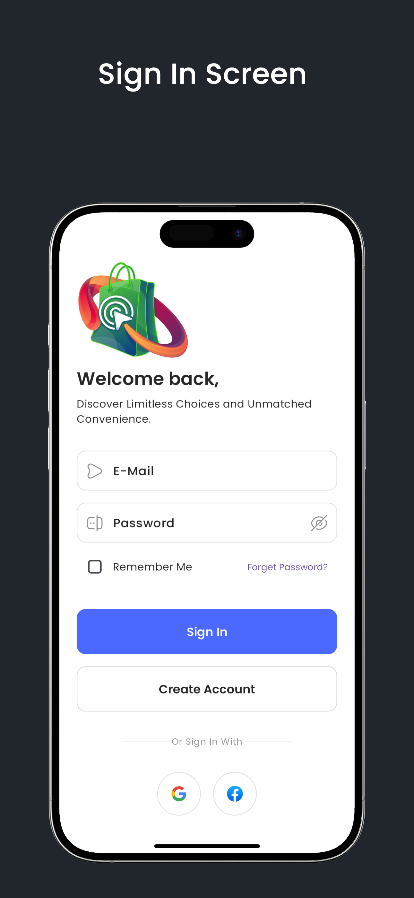
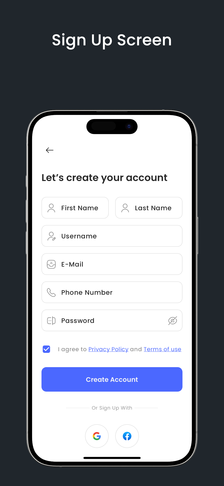
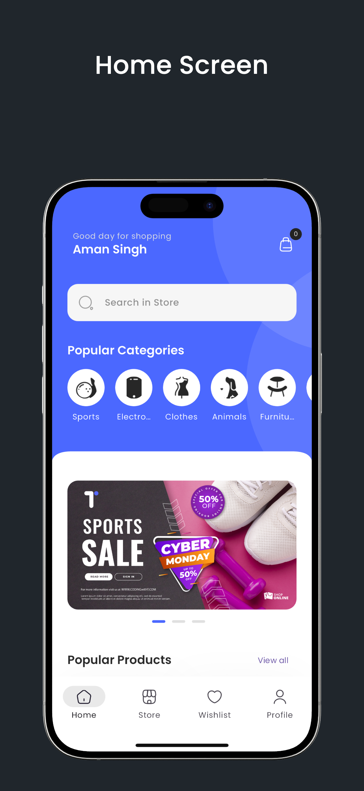
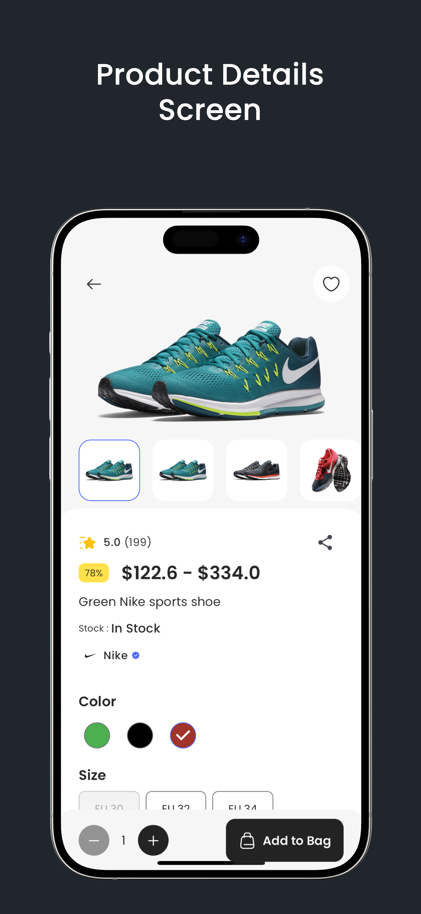
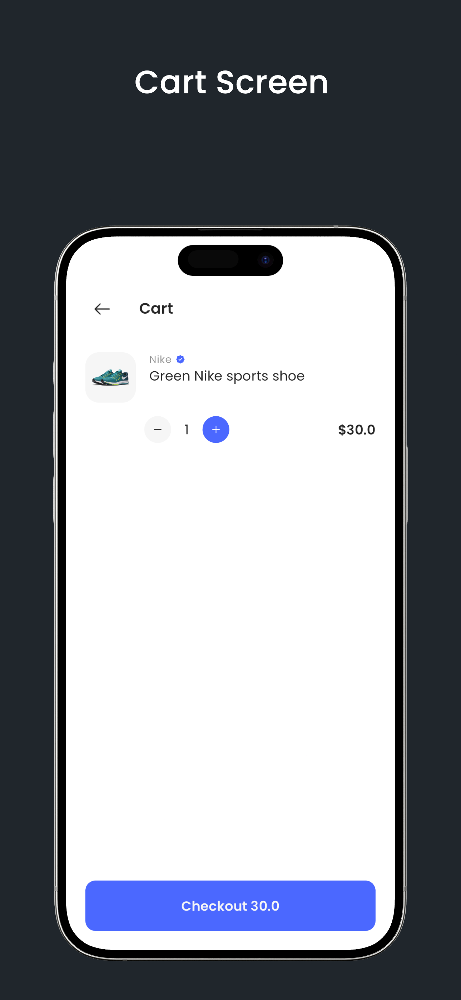
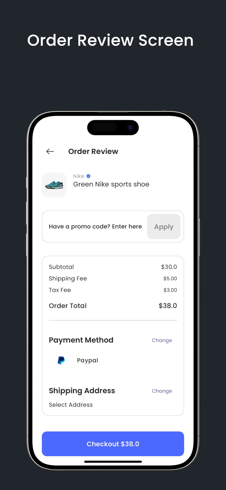
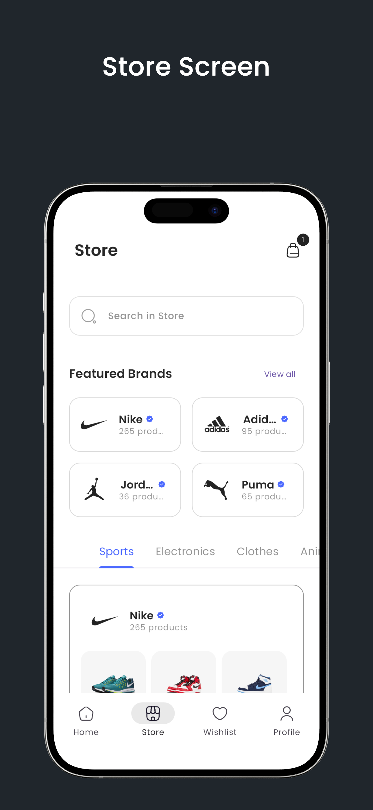
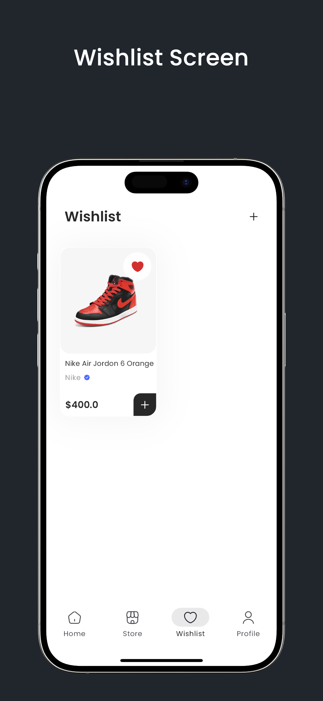
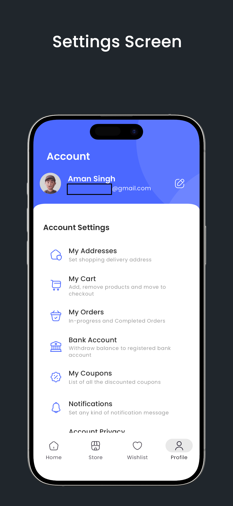

# eCommerce App

Welcome to the eCommerce App! The eCommerce App is a complete Flutter application for online shopping. It features user authentication, product listings, detailed product views, search functionality, a shopping cart, order management, and user profile management. Built with Flutter and Firebase, it offers a seamless and intuitive user experience.

- User Authentication (Sign In/Sign Up)
- Product Listings
- Product Details
- Search Functionality
- Shopping Cart
- Order Management
- User Profile Management

## Screenshots











## Installation

### Prerequisites

- Flutter SDK: [Installation Guide](https://flutter.dev/docs/get-started/install)
- A suitable IDE (VS Code, Android Studio, etc.)

### Steps

1. **Clone the repository:**

    ```bash
    git clone https://github.com/thesinghaman/ecommerce_app
    cd ecommerce_app
    ```

2. **Install dependencies:**

    ```bash
    flutter pub get
    ```

3. **Run the app:**

    ```bash
    flutter run
    ```

## Configuration

- Update the `pubspec.yaml` file with your required dependencies.
- Configure Firebase for authentication and database needs.

## Acknowledgements

- Thanks to the Flutter team for providing excellent documentation and tools.
- All the open-source libraries and contributors.
